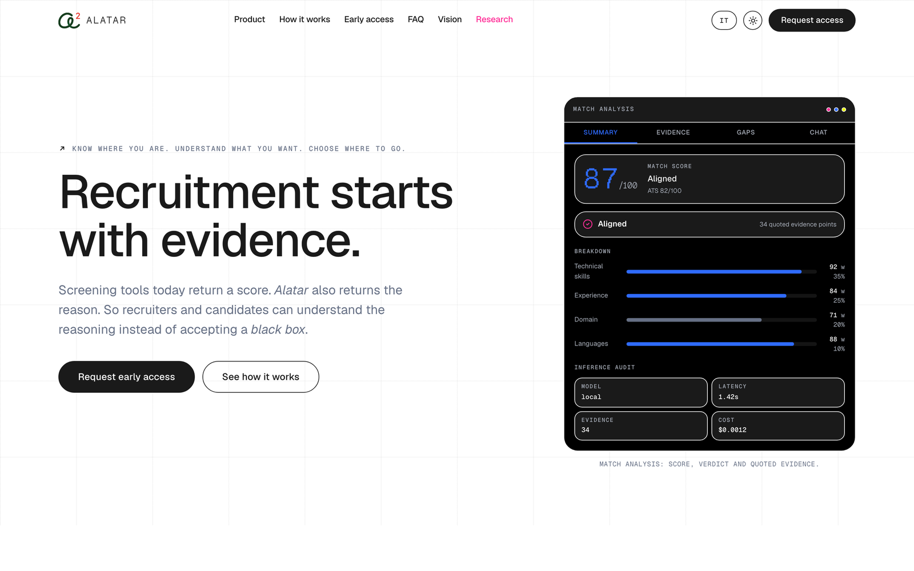
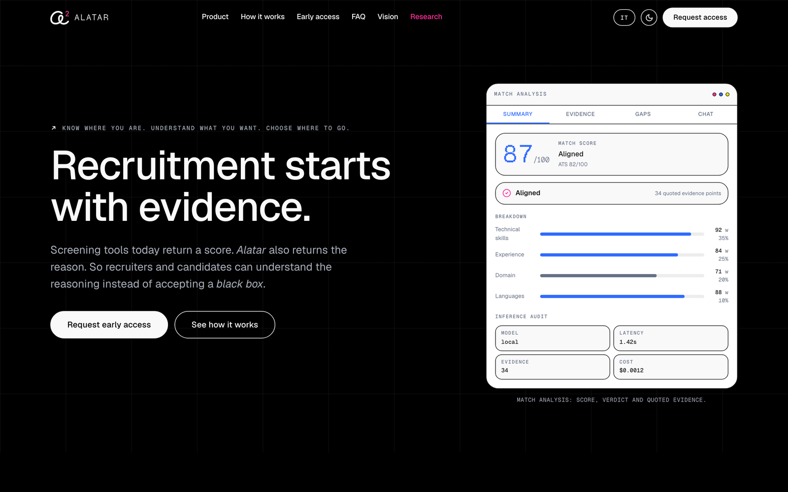
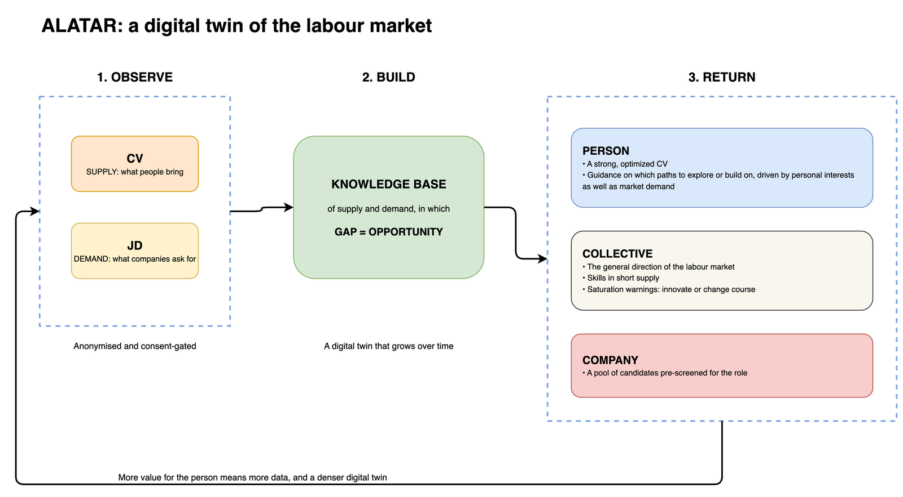

# Alatar: code samples

Three excerpts from the Python backend of Alatar, a career-intelligence platform that aligns a CV with a job description and returns a scored, evidence-backed match. These files were chosen to show engineering craft (clean architecture, SQL craft, and pragmatic document processing) without exposing the product's matching/scoring logic.

**Context:** see [../alatar.md](../alatar.md) for the full project overview.

**Stack:** Python 3.12, async SQLAlchemy + PostgreSQL (recursive CTEs), `Protocol`-based dependency inversion, frozen slotted dataclasses, `re`-based parsing.

## The product these samples sit behind

Match analysis: an overall score with an ATS reading, a per-category breakdown with its weights, the count of quoted evidence points behind the verdict, and an inference audit strip recording which model ran, how long it took, and what it cost. The interface mockups are drawn on brand in SVG, HTML and CSS rather than captured from the running product.

| | |
| --- | --- |
|  |  |
| The guided flow: every extracted field stays editable and every rewrite stays the user's decision. | The same surface in dark theme. |

The observation loop underneath the product: consented CVs read what people bring, postings read what companies ask for, and the distance between the two is observable opportunity rather than a forecast. `skill_graph_traversal.py` below is the query engine that walks the skill graph this loop builds.

## What each file shows

- **`skill_graph_traversal.py`**: a PostgreSQL-native recursive-CTE traversal engine. Two static SQL bodies (filtered or unfiltered) selected in Python so relation filters and depth limits are bound as parameters, never string-interpolated; `DISTINCT ON` dedupes the shortest path per node. Scales with the database instead of pulling the graph into Python.
- **`document_pipeline.py`**: deterministic two-tier PDF routing (a present text-layer uses native extraction; an absent one falls back to OCR) plus multilingual (IT and EN) regex section detection, returning a typed `ParsedDocument`. Fault-tolerant ingestion without over-engineering.
- **`provider_protocols.py`**: four lean `Protocol` contracts (vector store, LLM gateway, embeddings, database) with typed request/response dataclasses. Dependency inversion that lets adapters (Qdrant or pgvector, Anthropic or OpenAI, self-hosted or managed) swap without touching callers.

## Deliberately omitted

To protect the product's value, none of the following are included here:

- The CV-to-JD scoring/matching algorithm, category weights, or tier multipliers.
- The evidence-chain ranking and grounding logic that produces the auditable verdict.
- Skill-transferability inference (how traversal results are turned into a match signal), tier thresholds, and calibration constants.
- LLM prompt templates, extraction schemas, and any secrets, credentials, connection strings, or tenant/customer data.

Imports of internal toolkits and sibling modules have been stubbed or trimmed so each file reads standalone. These are faithful excerpts, lightly adapted, with real structure and style preserved.

_© 2026 Edoardo Caciolo, all rights reserved. Portfolio excerpt shared to demonstrate engineering; not licensed for reuse. Full source is private._
