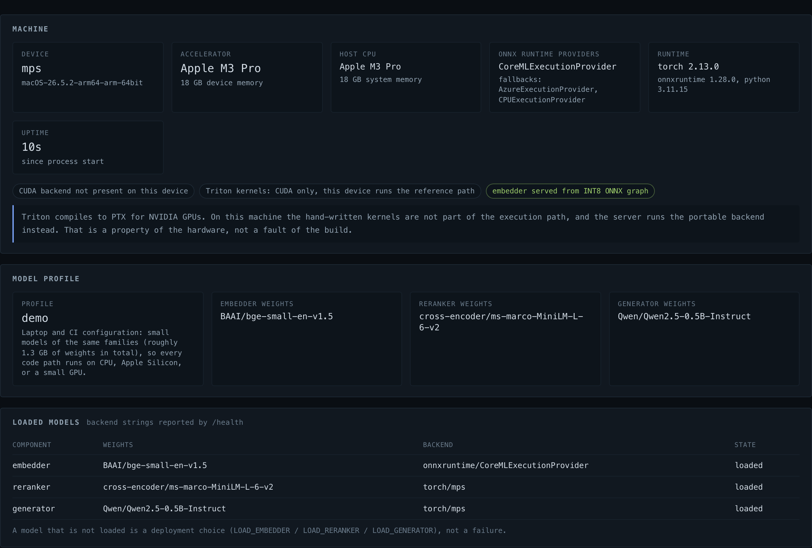
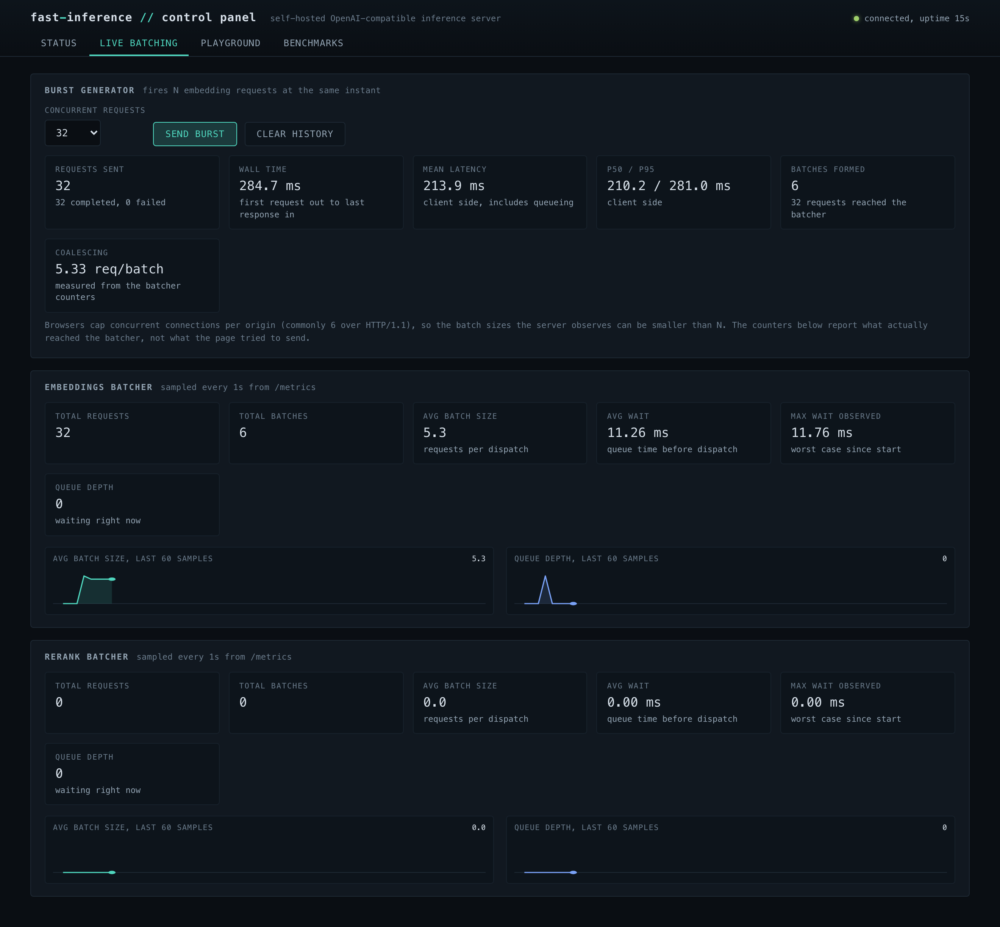
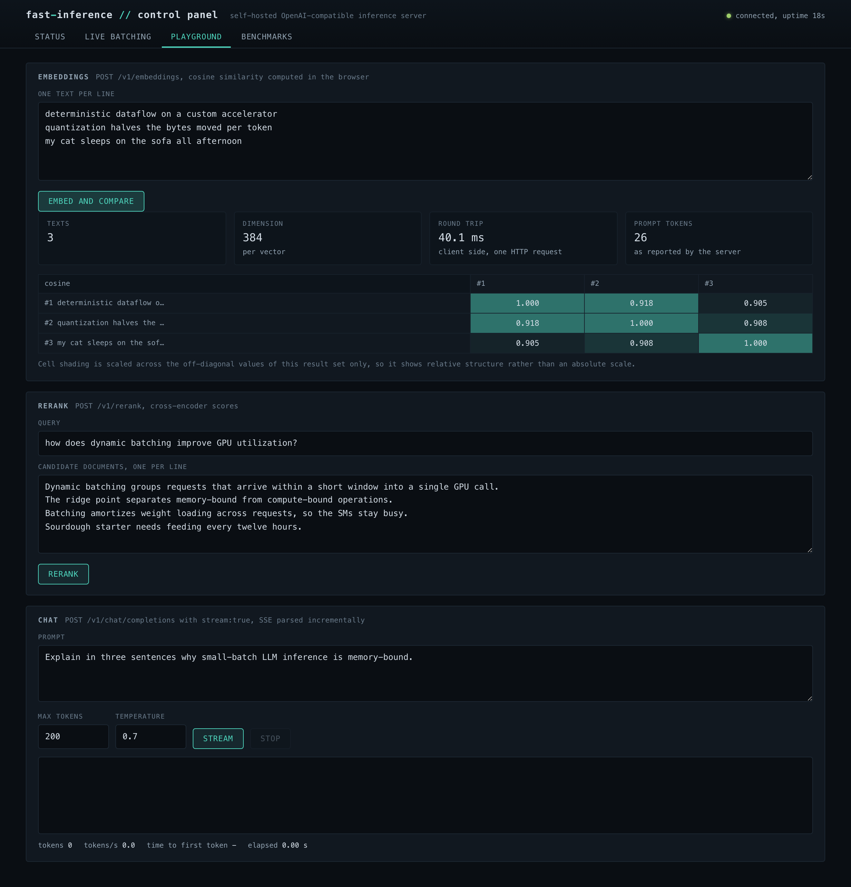
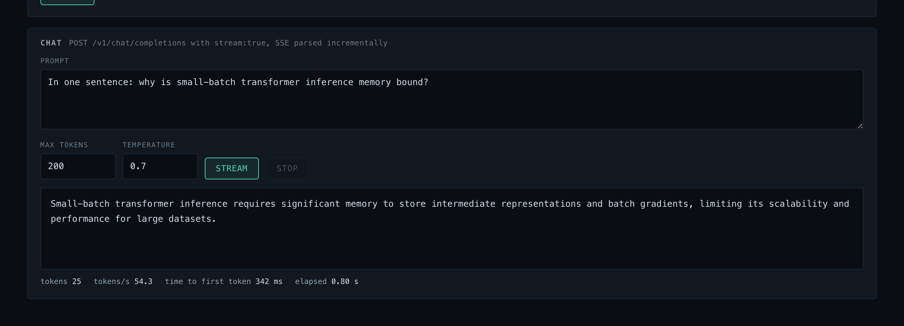
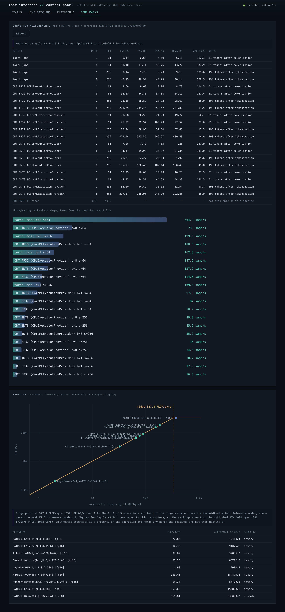

# fast-inference

> A self-hosted, OpenAI-compatible inference server for embedding, reranking, and generation models, built to keep retrieval-augmented generation (RAG) workloads fast and fully on-premise.

## Overview

fast-inference serves embedding, reranking, and text-generation models behind a single HTTP API that mirrors the widely used OpenAI and Cohere request/response schemas, so existing RAG clients can point at it with no code changes. It targets teams that want to run RAG locally instead of depending on a cloud provider: by keeping models on the machine, it removes network round-trips and keeps processed data in-house. The project pairs the serving layer with low-level GPU optimization and a benchmark suite, demonstrating the full inference-serving stack end to end.

## Highlights

- **Drop-in OpenAI/Cohere-compatible API**: embeddings, chat completions with streaming, and reranking endpoints, plus health and metrics, validated against the public schemas so existing clients integrate without changes.
- **GPU-level performance engineering**: hand-written Triton kernels (fused RMSNorm/LayerNorm using single-pass Welford statistics, tiled attention with online softmax, fused SwiGLU activations) and memory-aware execution reduce HBM traffic for the small-batch, memory-bound regime typical of RAG, cutting latency without sacrificing accuracy on precision-sensitive operations.
- **Low-precision quantization**: an INT8 quantization path shrinks model footprint and speeds inference while protecting numerically sensitive layers, delivering smaller, faster models with controlled quality impact.
- **High-throughput request handling**: asynchronous dynamic batching coalesces concurrent requests into efficient GPU batches, with error fan-out to every waiting caller and drain-on-stop; a thread-safe pre-allocated tensor pool backs the torch embedding path, padding requests up to fixed length buckets so the hot path allocates nothing and the framework's per-shape planning caches stay warm; the pooled and unpooled paths produce bit-identical embeddings.
- **Distributed, fault-tolerant serving**: a health-aware load balancer routes traffic to the best-performing healthy worker and fails fast when capacity is unavailable, keeping the service responsive under partial outages.
- **Multiple model classes**: wraps a BGE-m3 embedder, a BGE-reranker-v2-m3 cross-encoder, and a Qwen2.5-7B-Instruct generator with KV-cache behind one consistent interface, with streaming and standard sampling controls for generation.
- **Built-in benchmarking**: one command discovers the backends the current machine can execute, measures them with device synchronization before every timer stop (p50/p95/p99), and writes JSON plus a Markdown table carrying the full hardware description; backends the machine cannot run are reported with a reason and no numbers. Underneath it: throughput under concurrent load, latency sweeps across batch sizes and sequence lengths, a roofline analysis separating memory-bound from compute-bound kernels, and an end-to-end RAG cost comparison between cloud-API and local inference.

## Tech Stack

| Category | Technology |
|----------|------------|
| Language | Python (3.10 or newer) |
| GPU kernels | Triton |
| Quantization / inference runtime | ONNX Runtime GPU, ONNX |
| Generation backend | PyTorch, Transformers, Tokenizers |
| API | FastAPI, Uvicorn, Pydantic v2 |
| Distributed / networking | asyncio, httpx |
| Logging | structlog |
| Numerics | NumPy |
| Testing & quality | pytest, pytest-asyncio, pytest-benchmark, ruff, mypy (strict) |
| Optional (pipeline tooling) | LangGraph, OpenAI SDK, Matplotlib |
| Infrastructure | Docker, Docker Compose (NVIDIA CUDA base image) |

## Control panel

The server ships a self-contained operator dashboard (no build step, no external requests) that reports the machine it is running on, watches the batcher coalesce live traffic, exercises every endpoint, and renders the committed benchmark results.

Machine, capabilities and loaded models. Capabilities are stated as facts rather than failures: on hardware without CUDA the panel says the Triton kernels are not in the execution path and that this is a property of the machine, not a broken build.

The dynamic batcher under load. A burst generator fires N simultaneous embedding requests so the coalescing is visible: 32 requests reaching the batcher and leaving as 6 batches, with the queue wait sitting around the configured 10 ms window.

The playground calls the real endpoints: embeddings with the cosine matrix computed in the browser, cross-encoder reranking, and streaming generation reporting time to first token and tokens per second.

Measured backends and the analytical roofline. Backends the machine cannot run are listed with their reason and no numbers; the roofline states which hardware specification its ceilings come from and that nothing in it was executed.

## Status

Prototype / portfolio engineering project, single-author, structured and documented like a production server. The full path (Triton kernels, CUDA execution provider, fp16 tensor cores) targets NVIDIA GPUs; the same code serves models on Apple Silicon (torch on Metal, ONNX Runtime on the Neural Engine) and on CPU, and reports which one it is actually using.

What is real, and what is not, stated plainly:

- Runs end to end on CUDA, Apple Silicon and CPU: server, dashboard, quantization pipeline and benchmark harness were all exercised on a laptop before this page was written.
- The Triton kernels are an optimization and ablation layer, not the serving path, and compile for CUDA only.
- The distributed router, circuit breaker and worker manager are implemented and unit-tested, but no gateway wires them into the serving path yet.
- Performance figures are only quoted from committed benchmark files with their hardware attached. An earlier results table was retracted from the repository because it was never a committed measurement.

Source code private, review available on request.

---

## Code sample

A small, IP-safe excerpt is in [`fast-inference/`](./fast-inference/): INT8 static quantization for ONNX transformers (a calibration reader, an op skip-list that keeps precision-sensitive layers in float, per-channel weight quantization, and FP32-versus-INT8 cosine validation), plus the serving-layer utilities: a dynamic request batcher, a pre-allocated GPU tensor pool, and a circuit-breaker health checker.

_© 2026 Edoardo Caciolo, all rights reserved. Source code is private and available for review on request._
